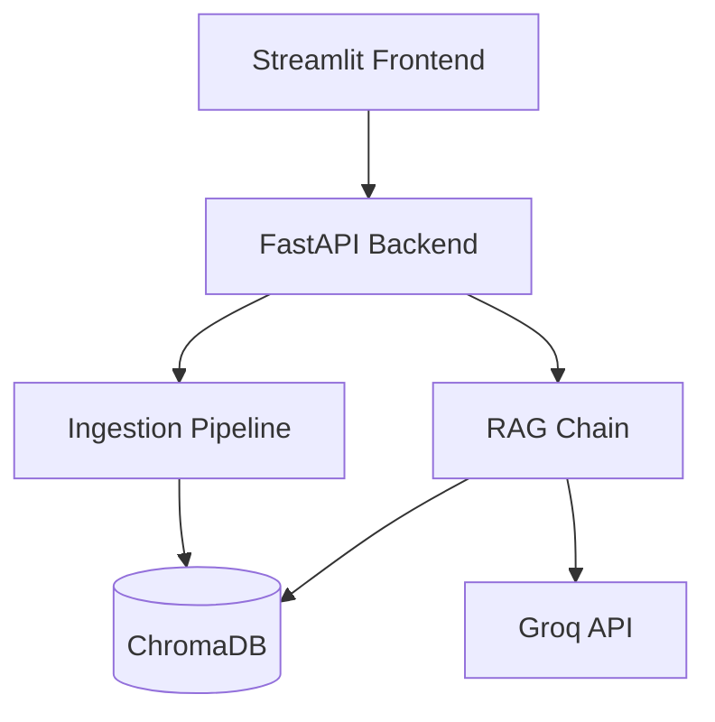

<div align="center">

# 📚 Retrievault

*A Retrieval-Augmented Generation System for Conversational Q&A Over Documents*


<br>

Built with the tools and technologies:  


</div>

---

## 🧠 Project Summary

**Retrievault** is a retrieval-augmented generation (RAG) system for conversational question-answering over documents. Upload PDF, DOCX, TXT, or XLSX files and ask natural-language questions grounded strictly in their content.

Retrievault combines document ingestion, semantic search, and large language model generation into a single pipeline. Documents are parsed, chunked, embedded, and stored in a local vector database; user questions are answered using only the retrieved context, with source attribution and multi-turn conversation memory.

---

## 🚀 Features

- 📄 **Multi-Format Document Ingestion**
  Supports PDF, DOCX, TXT, and XLSX files

- ✂️ **Semantic Chunking & Embedding**
  Powered by HuggingFace sentence-transformers (`all-MiniLM-L6-v2`)

- 🗄️ **Persistent Vector Storage**
  Local vector database using ChromaDB

- 🧠 **LLM-Powered Answer Generation**
  Via Groq (`llama-3.3-70b-versatile`)

- 💬 **Conversation Memory**
  Context-aware follow-up questions across multi-turn chats

- 🔗 **Source Citation**
  Every answer includes the source document(s) it was drawn from

- ⚡ **FastAPI Backend + Streamlit Frontend**
  Clean separation between API and chat interface

---

## 🗃️ Project Structure

```bash
Retrievault/
├── app/
│   ├── config.py
│   ├── ingestion/loaders.py
│   ├── core/
│   │   ├── vectorstore.py
│   │   ├── memory.py
│   │   └── rag_chain.py
│   ├── api/main.py
│   └── utils/text_splitter.py
├── frontend/streamlit_app.py
├── tests
│   ├── test_ingestion
├── data/
│   └── uploads/
├── requirements.txt
├── .env.example
├── .gitignore
└── README.md
```

---

## 🔧 Setup & Installation

> Make sure Python 3.10+ is installed, along with a free Groq API key from [console.groq.com](https://console.groq.com).

### Backend

```bash
# Clone the repo
git clone https://github.com/Muhammad-Ahmed-Rayyan/Retrievault-RAG.git
cd Retrievault

# Create and activate a virtual environment
python -m venv venv
venv\Scripts\activate

# Install required libraries
pip install -r requirements.txt

# Set up environment variables
copy .env.example .env
```

Start the backend server:

```bash
uvicorn app.api.main:app --reload --port 8000
```

> ⏳ The first startup preloads the embedding model, which may take a minute or two while it downloads. Wait for `Embedding model ready.` in the terminal before uploading documents.

### Frontend

In a separate terminal:

```bash
# Run the Streamlit app
streamlit run frontend/streamlit_app.py
```

Open `http://localhost:8501` in your browser.

---

## 🔑 API Configuration

Edit `.env` and add your Groq API key:

```.env
GROQ_API_KEY="YOUR-GROQ-API-KEY"
```

---

## 🏗️ Architecture



See `docs/architecture.md` for the full architecture, flow, and state diagrams.

---

## 📖 Usage

1. Upload a document (PDF, DOCX, TXT, or XLSX) from the sidebar.
2. Wait for indexing to complete.
3. Ask questions about the document's content in the chat panel.
4. Each answer includes the source document(s) it was drawn from.

---

<div align="center">

⭐ Found this project useful? Drop a star on GitHub!

</div>