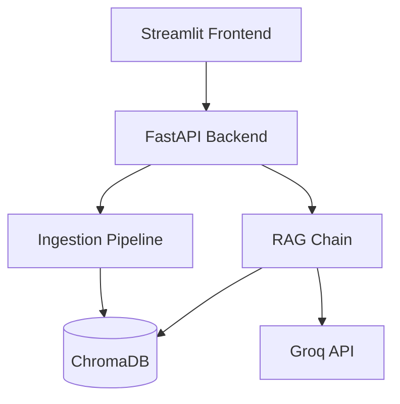

# Retrievault

A retrieval-augmented generation (RAG) system for conversational question-answering over documents. Upload PDF, DOCX, TXT, or XLSX files and ask natural-language questions grounded strictly in their content.

## Overview

Retrievault combines document ingestion, semantic search, and large language model generation into a single pipeline. Documents are parsed, chunked, embedded, and stored in a local vector database; user questions are answered using only the retrieved context, with source attribution and multi-turn conversation memory.

## Features

- Multi-format document ingestion: PDF, DOCX, TXT, XLSX
- Semantic chunking and embedding via HuggingFace sentence-transformers
- Persistent vector storage using ChromaDB
- LLM-powered answer generation via Groq (llama-3.3-70b-versatile)
- Conversation memory for context-aware follow-up questions
- Source citation for every answer
- FastAPI backend with a Streamlit chat interface

## Architecture



See `docs/architecture.md` for the full architecture, flow, and state diagrams.

## Tech stack

| Layer | Technology |
|---|---|
| LLM | Groq (llama-3.3-70b-versatile) |
| Orchestration | LangChain |
| Vector database | ChromaDB |
| Embeddings | sentence-transformers/all-MiniLM-L6-v2 |
| Backend | FastAPI |
| Frontend | Streamlit |
| Document parsing | pypdf, docx2txt, unstructured |

## Project structure

```
Retrievault/
├── app/
│   ├── config.py
│   ├── ingestion/loaders.py
│   ├── core/
│   │   ├── vectorstore.py
│   │   ├── memory.py
│   │   └── rag_chain.py
│   ├── api/main.py
│   └── utils/text_splitter.py
├── frontend/streamlit_app.py
├── data/sample_docs/
├── docs/
├── requirements.txt
├── .env.example
└── README.md
```

## Installation

### Prerequisites
- Python 3.10+
- A free Groq API key from [console.groq.com](https://console.groq.com)

### Setup

```bash
git clone https://github.com/Muhammad-Ahmed-Rayyan/Retrievault.git
cd Retrievault

python -m venv venv
venv\Scripts\activate

pip install -r requirements.txt

copy .env.example .env
```

Edit `.env` and add your Groq API key:

```
GROQ_API_KEY=your_key_here
```

## Running the application

Start the backend:

```bash
uvicorn app.api.main:app --reload --port 8000
```

In a separate terminal, start the frontend:

```bash
streamlit run frontend/streamlit_app.py
```

Open `http://localhost:8501` in your browser.

## Usage

1. Upload a document (PDF, DOCX, TXT, or XLSX) from the sidebar.
2. Wait for indexing to complete.
3. Ask questions about the document's content in the chat panel.
4. Each answer includes the source document(s) it was drawn from.

## Sample documents

The `data/sample_docs/` directory contains representative test files spanning technical, narrative, tabular, and reference content, used to validate ingestion and retrieval across formats.

## Limitations

- Vector store is local and file-based; not designed for multi-user concurrent write access.
- XLSX ingestion works best for row-level lookups; complex cross-row aggregation may require additional tooling.
- Conversation memory is in-process and session-scoped; it does not persist across application restarts.

## Future improvements

- Persistent, database-backed conversation memory
- Support for additional file formats (CSV, HTML, Markdown)
- Optional Django-based web interface
- Hybrid search (keyword + semantic)