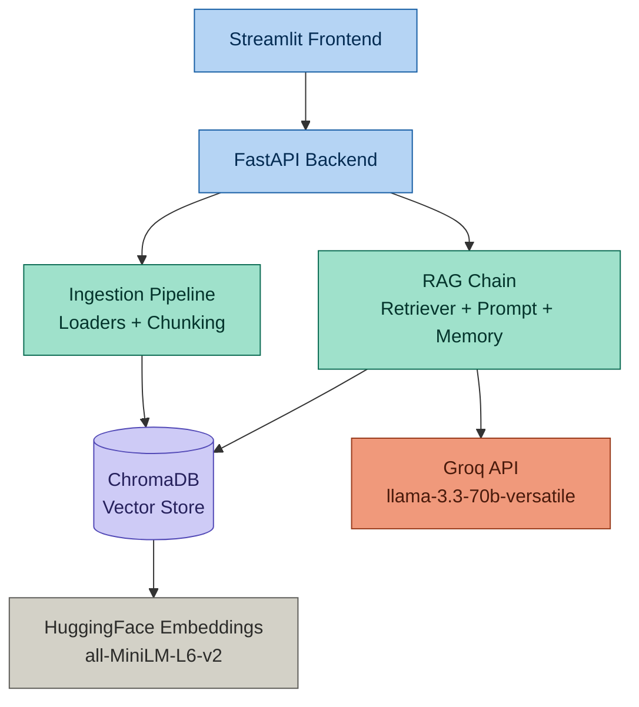
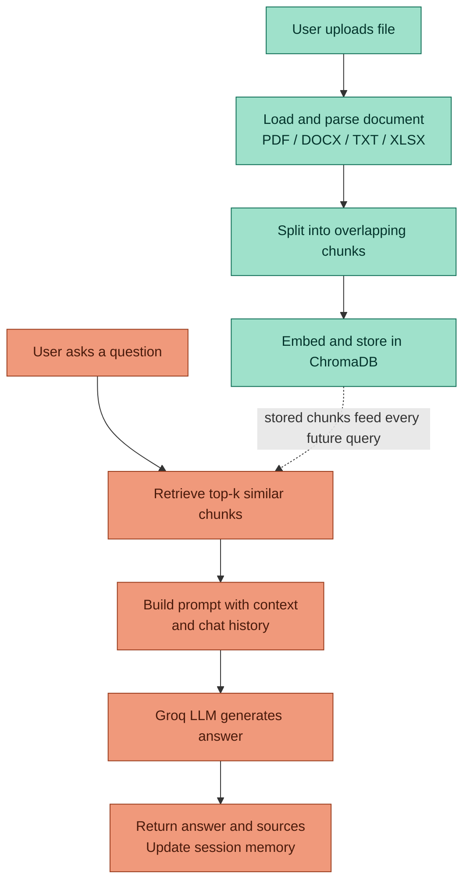
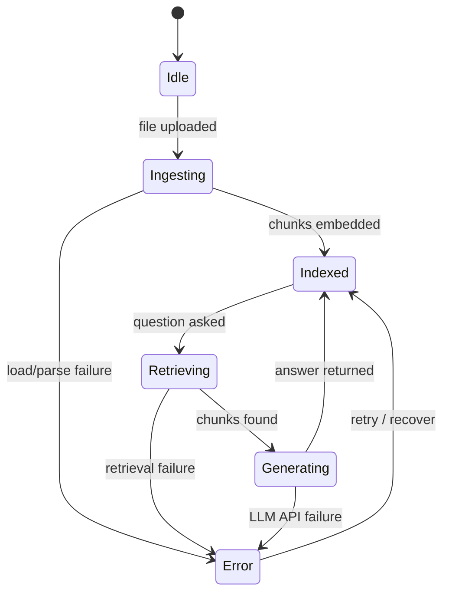

### 1. System Architecture

```mermaid
graph TD
    UI[Streamlit Frontend] --> API[FastAPI Backend]
    API --> ING[Ingestion Pipeline<br/>Loaders + Chunking]
    API --> RAG[RAG Chain<br/>Retriever + Prompt + Memory]
    ING --> VDB[(ChromaDB<br/>Vector Store)]
    RAG --> VDB
    VDB --> EMB[HuggingFace Embeddings<br/>all-MiniLM-L6-v2]
    RAG --> LLM[Groq API<br/>llama-3.3-70b-versatile]

    style UI fill:#B5D4F4,stroke:#185FA5,color:#042C53
    style API fill:#B5D4F4,stroke:#185FA5,color:#042C53
    style ING fill:#9FE1CB,stroke:#0F6E56,color:#04342C
    style RAG fill:#9FE1CB,stroke:#0F6E56,color:#04342C
    style VDB fill:#CECBF6,stroke:#534AB7,color:#26215C
    style EMB fill:#D3D1C7,stroke:#5F5E5A,color:#2C2C2A
    style LLM fill:#F0997B,stroke:#993C1D,color:#4A1B0C
```

### 2. Flow Diagram

```mermaid
flowchart TD
    A1[User uploads file] --> A2[Load and parse document<br/>PDF / DOCX / TXT / XLSX]
    A2 --> A3[Split into overlapping chunks]
    A3 --> A4[Embed and store in ChromaDB]

    B1[User asks a question] --> B2[Retrieve top-k similar chunks]
    B2 --> B3[Build prompt with context<br/>and chat history]
    B3 --> B4[Groq LLM generates answer]
    B4 --> B5[Return answer and sources<br/>Update session memory]

    A4 -.stored chunks feed every future query.-> B2

    style A1 fill:#9FE1CB,stroke:#0F6E56,color:#04342C
    style A2 fill:#9FE1CB,stroke:#0F6E56,color:#04342C
    style A3 fill:#9FE1CB,stroke:#0F6E56,color:#04342C
    style A4 fill:#9FE1CB,stroke:#0F6E56,color:#04342C

    style B1 fill:#F0997B,stroke:#993C1D,color:#4A1B0C
    style B2 fill:#F0997B,stroke:#993C1D,color:#4A1B0C
    style B3 fill:#F0997B,stroke:#993C1D,color:#4A1B0C
    style B4 fill:#F0997B,stroke:#993C1D,color:#4A1B0C
    style B5 fill:#F0997B,stroke:#993C1D,color:#4A1B0C
```

### 3. State Diagram

```mermaid
stateDiagram-v2
    [*] --> Idle
    Idle --> Ingesting: file uploaded
    Ingesting --> Indexed: chunks embedded
    Ingesting --> Error: load/parse failure
    Indexed --> Retrieving: question asked
    Retrieving --> Generating: chunks found
    Retrieving --> Error: retrieval failure
    Generating --> Indexed: answer returned
    Generating --> Error: LLM API failure
    Error --> Indexed: retry / recover
```